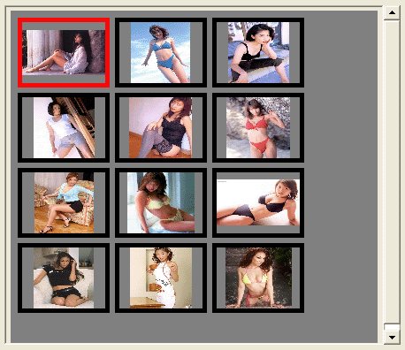



## The Easiest Thumbnail Viewer Control \(Improved\)

### Description

This is an improved version of the EASY to implement thumbnail viewer control. Just load it with image loactions and refresh it. It has several options and it can be incorporated into your app by drawing it onto your form and filling it with images. It uses an array for holding image locations so the files to be displayed can be loaded from anywhere. It now has additional properties, features and several fixes that make it far more useful. And of course, a new screen shot.
 
### More Info
 

             |
---                |---
**Submitted On**   |2002-06-08 14:14:38
**By**             |[Peter\_Jackson](https://github.com/Planet-Source-Code/PSCIndex/blob/master/ByAuthor/peter-jackson.md)
**Level**          |Beginner
**User Rating**    |4.0 (8 globes from 2 users)
**Compatibility**  |VB 5\.0, VB 6\.0
**Category**       |[Graphics](https://github.com/Planet-Source-Code/PSCIndex/blob/master/ByCategory/graphics__1-46.md)
**World**          |[Visual Basic](https://github.com/Planet-Source-Code/PSCIndex/blob/master/ByWorld/visual-basic.md)
**Archive File**   |[The\_Easies91887682002\.zip](https://github.com/Planet-Source-Code/peter-jackson-the-easiest-thumbnail-viewer-control-improved__1-35621/archive/master.zip)

